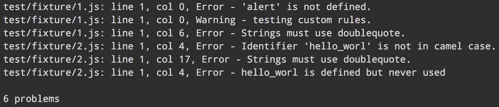

# eslint-stylish [](http://travis-ci.org/sindresorhus/eslint-stylish)

**Deprecated** as it's now the default reporter in [ESLint](https://github.com/nzakas/eslint/)

---

>  Stylish formatter (reporter) for [ESLint](https://github.com/nzakas/eslint/)


Compared to the default formatter:




## Install

```bash
$ npm install --save-dev eslint-stylish
```


## Getting started

Use it with:

#### ESLint CLI

```
eslint --format node_modules/eslint-stylish/stylish.js file.js
```

#### [grunt-eslint](https://github.com/sindresorhus/grunt-eslint/)

```js
grunt.initConfig({
	eslint: {
		options: {
			format: require('eslint-stylish')
		},
		target: ['file.js']
	}
});

grunt.loadNpmTasks('grunt-eslint');
grunt.registerTask('default', ['eslint']);
```


## License

[MIT](http://opensource.org/licenses/MIT) © [Sindre Sorhus](http://sindresorhus.com)
